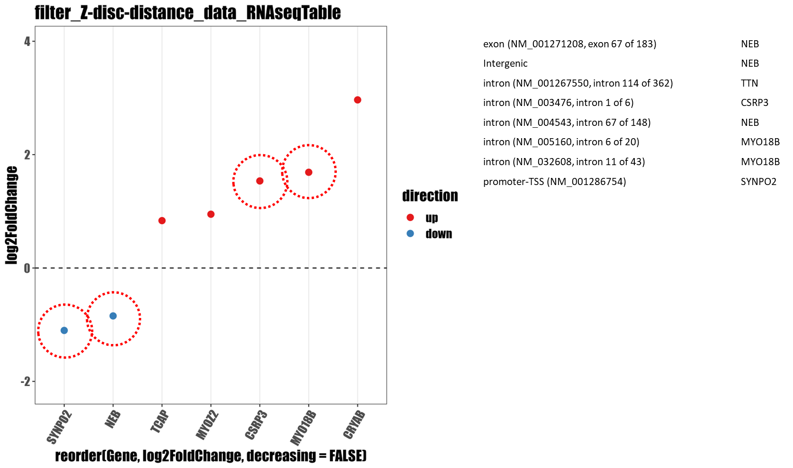

# Processing the ChIP-seq data


## Notes

### Example graph

Giancarlo looks happy with the graph where there is an indication what is directly regulated by YAP1 from the ChIPseq


<figure><figcaption></figcaption></figure>


### What next

So I want to make the same graphs for the&#x20;

1. sarcomere
2. Z-disc
3. Calcium and other channels
4. Costamere

I want to improve the way how I do the filtering, as it would make sense to join the information from the ChIPseq into the RNAseq datafile, so that I can then improve the plotting.

### How to do it

The idea is I could add the different categories (intron, exon, 3' UTR, 5' UTR, TSS) as columns with a value of matches therefore I can adjust the plotting script in R

## Current code for the filtering

```
# transform a comma inside a chipseq file (usually where there is an intron)
sed 's/, /: /g' data_ChIP-seq\ day\ 10.csv > data_ChIP-seq_d-10_fixed.csv 
```

```
# get the genename from the filetered chipseq file
cut -d, -f16 chipseq_Z-disc.csv |  uniq -c | sort -r
```

## Future code

```
# Aim: filter a fixed chipseq file by text file with names of genes

# 05. transform a comma inside a chipseq file  into a column

# 10. put comma in the beginning and end of the term

# 20. filter the chipseq file the comma-fixed file

# 25. Select the intron/region and gene column

# 26. Export it into a table

# 28. Select the gene field

# 30. Do counting of the genes and output it to 

# 40. Do a join of the rnaseq data with the chipseq count data into a new column


```


```
# Do it from a different side
# Join the rna-seq with the summary from the chipseq add a column of hits

# do this for each of the characteristics TSS, 


```

```
# count the numbers of the bindings for each gene
```


```
# create a table with the locus specification and name of the gene
```
