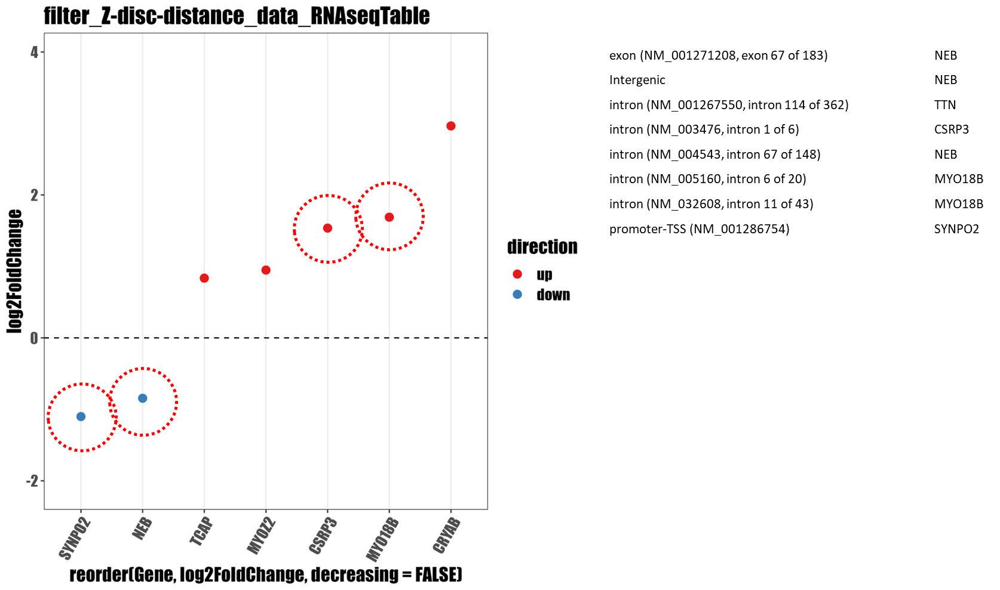

# Processing the ChIP-seq data


## Notes

### Example graph

Giancarlo looks happy with the graph where there is an indication what is directly regulated by YAP1 from the ChIPseq


<figure><figcaption></figcaption></figure>


### What next

So I want to make the same graphs for the&#x20;

1. sarcomere
2. Z-disc
3. Calcium and other channels
4. Costamere

I want to improve the way how I do the filtering, as it would make sense to join the information from the ChIPseq into the RNAseq datafile, so that I can then improve the plotting.

### How to do it

The idea is I could add the different categories (intron, exon, 3' UTR, 5' UTR, TSS) as columns with a value of matches therefore I can adjust the plotting script in R

## Current code for the filtering


```
 # filter the data_ChIP-seq... by the filter
 # maybe should use the script? may try this...
 grep -if filt_Z-disc.txt data_ChIP-seq\ day\ 10.csv > chipseq_Z-disc.csv
```


#### Script to filter chipseq data: script\_filter\_chipseq.sh

This script surrounds the gene name with commas to have a strict filtering, obviously can make it less strict, by dropping the first or second comma.


```bash
#!/bin/bash

if [[ $# -eq 0 ]]
  then
    echo "This script filters a csv file containing gene expression data (eg. rna-seq data) by one or more files containing sets of genes coming from gene ontology)"
    echo "Usage: ${0} file-with-gene-names [another-file-with-gene-names]... RNASeq-table"
    echo "file-with-gene-names contains one gene name/symbol per line"
    echo "RNA-Seq-table contains the gene name/symbol column and fold change column"
    exit 1
fi

# filter by the file
filtered_file="${!#}"
# make a directory for the filtered results
filtered_results="filtered-results_${filtered_file}"
timestamp="$(date +%H-%M-%S_%b-%d)"
dir_name="${filtered_results}_${timestamp}"
mkdir "${dir_name}"
#exit 0


# echo $filtered_file
header="$(head -n 1 "${filtered_file}")"
echo "${header}"
# exit 0

for filter in ${@:1:$#-1}
  do
    echo "Filtering by: ${filter}"
    sed '/,/!s/^/,/' "${filter}" > filter_comma_at_start
    sed 's/$/,/g' filter_comma_at_start > filter_with_commas
    grep -if filter_with_commas "${filtered_file}" > "no-header_${filter}_${filtered_file}"
    echo "${header}" > "${dir_name}/${filter}_${filtered_file}"
    cat "no-header_${filter}_${filtered_file}" >> "${dir_name}/${filter}_${filtered_file}"
    rm "no-header_${filter}_${filtered_file}"
    rm filter_comma_at_start
    rm filter_with_commas
    echo "Filtering by ${filter} is done"
done

echo "Script is done"
exit 0
i
```

```
# transform a comma inside a chipseq file (usually where there is an intron)
sed 's/, /: /g' data_ChIP-seq\ day\ 10.csv > data_ChIP-seq_d-10_fixed.csv 
```


```
# get the genename from the filetered chipseq file
cut -d, -f16 chipseq_Z-disc.csv |  uniq -c | sort -r
```

## Join the RNA-seq with chipseq data


```

# read the filtering terms from a file
## ideally have a key value pairs separated by a space or colon

# filter given file with multiple terms and separate the matching data into a file 
# with a specific name the terms are supposed to be in an array

# cut out the column of the gene_symbol 

# count the unique values to get the numbers of what is bound where

# add the headers gene_symbol, count_intron
# This I can fix 

# join with the rna-seq data
## sort the rna-seq data by the gene-symbol name
## sort the binding-counts files by gene-symbol

# join in defined order these columns 

# add the header for the file

 

```

## Future code

```
# Aim: filter a fixed chipseq file by text file with names of genes

# 05. transform a comma inside a chipseq file  into a column

# 10. put comma in the beginning and end of the term

# 20. filter the chipseq file the comma-fixed file

# 25. Select the intron/region and gene column

# 26. Export it into a table

# 28. Select the gene field

# 30. Do counting of the genes and output it to 

# 40. Do a join of the rnaseq data with the chipseq count data into a new column


```


```
# Do it from a different side
# Join the rna-seq with the summary from the chipseq add a column of hits

# do this for each of the characteristics TSS, 


```

```
# count the numbers of the bindings for each gene
```


```
# create a table with the locus specification and name of the gene
```
