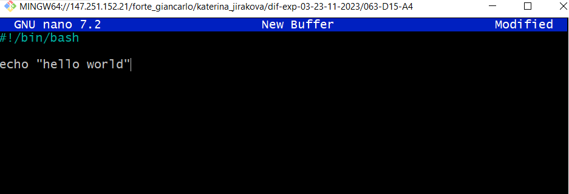
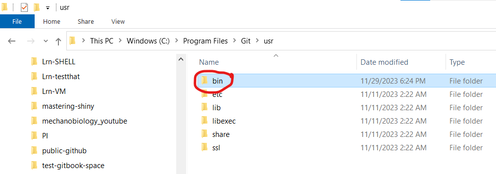
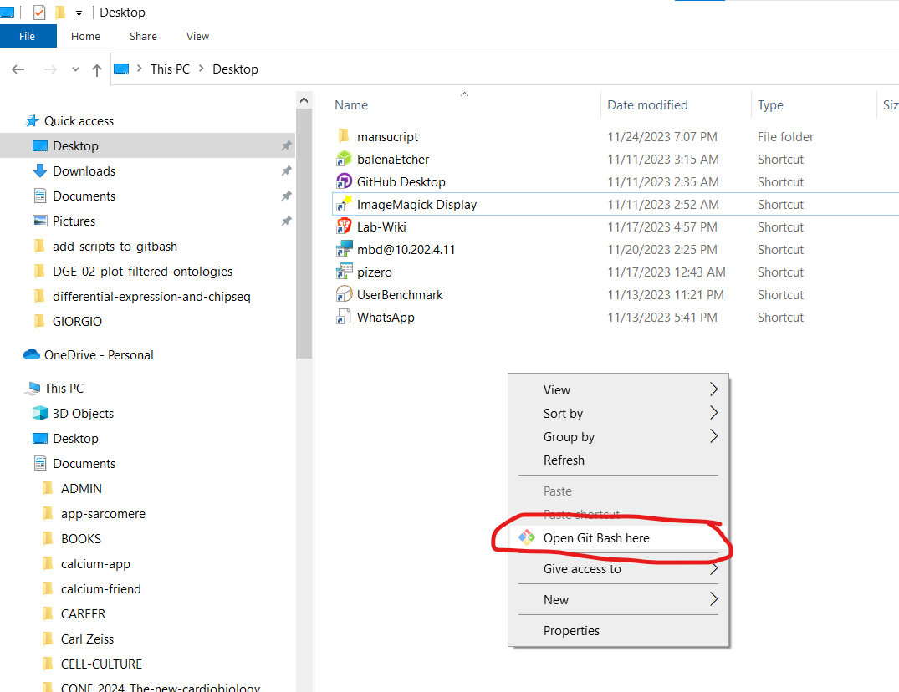

# Add script "as a programme"

## Create the script

Create the script in nano or notepad and save it (extension does not matter)

The first line must be `#!/bin/bash` to make it executed by bash.&#x20;

<figure><figcaption>
the script
</figcaption></figure>

## Copy into \`/usr/bin/\` folder

locate your `/usr/bin/` folder on windows

<figure><figcaption>
Location of <code>/usr/bin/</code> folder 
</figcaption></figure>

## Copy as administrator

<figure><figcaption>
copy as administrator
</figcaption></figure>

## See its copied

<figure><figcaption>
<code>hello_world</code> is in the <code>/usr/bin/</code>
</figcaption></figure>

## Restart bash

<figure><figcaption>
close GitBash
</figcaption></figure>

## Open GitBash wherever you want

<figure><figcaption>
open GitBash
</figcaption></figure>

## Check \`hello\_world\` is in /usr/bin/ "as a programme"

<figure><figcaption>
<code>hello_world</code> exists
</figcaption></figure>

## Run the file

### Start typing \`hello\` and use Tab completion

<figure><figcaption>
Tab complete
</figcaption></figure>

<figure><figcaption>
after tab completion
</figcaption></figure>

### Script runs

<figure><figcaption>
Script runs as a programme
</figcaption></figure>

