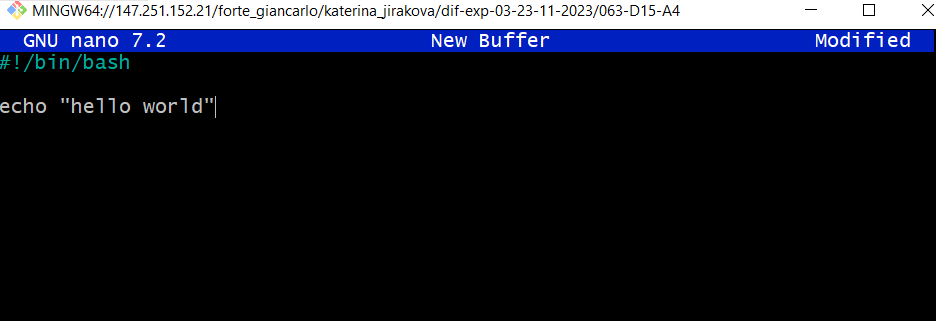
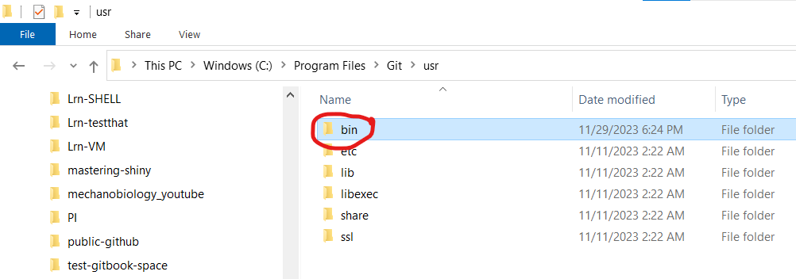
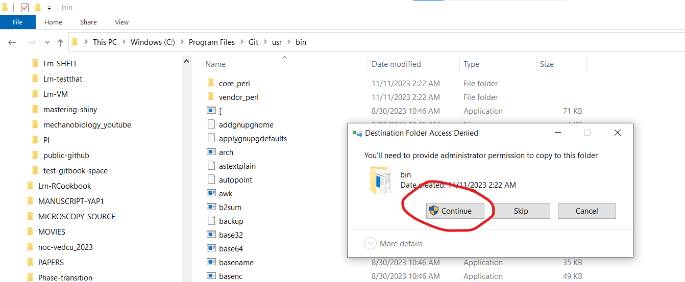
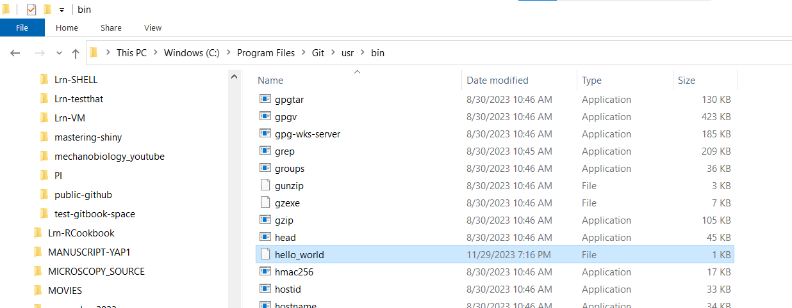
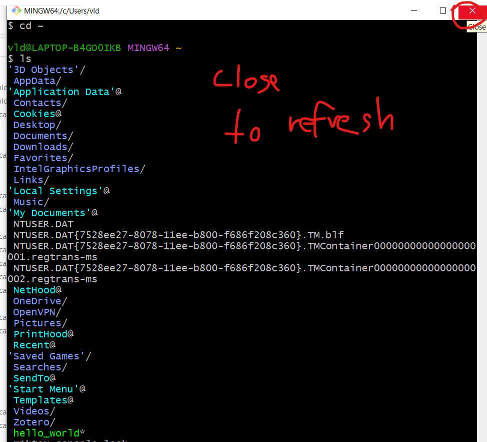
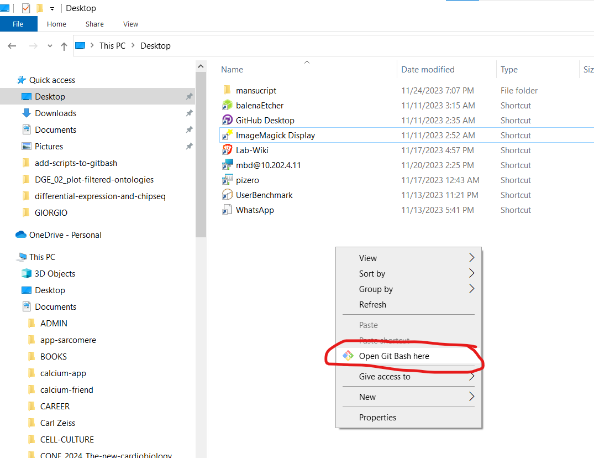
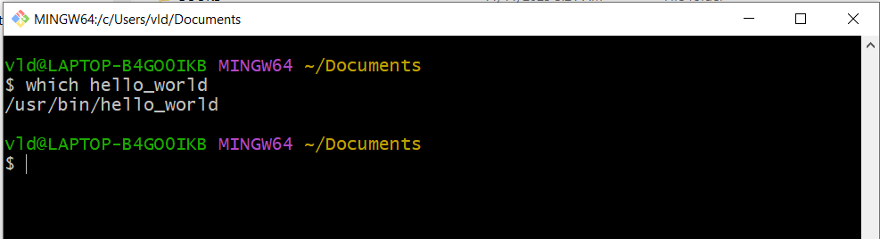
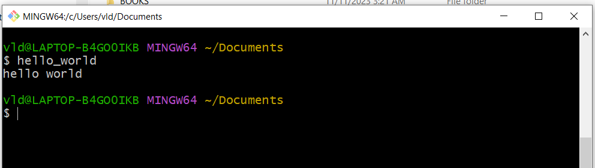

# Adding script "as programme"

## Create the script

Create the script in nano or notepad and save it (extension does not matter)

The first line must be `#!/bin/bash` to make it executed by bash.&#x20;

<figure><figcaption></figcaption></figure>

## Copy into \`/usr/bin/\` folder

locate your `/usr/bin/` folder on windows

<figure><figcaption>
Location of <code>/usr/bin/</code> folder 
</figcaption></figure>

## Copy as administrator

## See its copied

## Restart bash

## Open GitBash wherever you want

## Check \`hello\_world\` is in /usr/bin/ "as a programme"

## Run the file

### Start typing \`hello\` and use Tab completion

### Script runs

