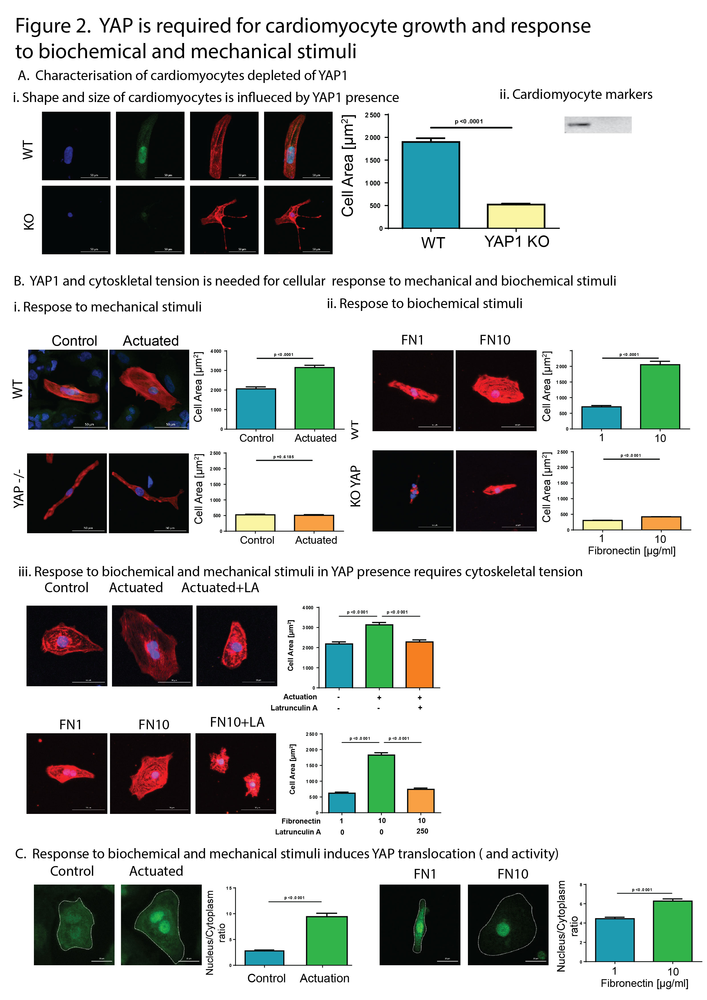

# Filtering cell-size data

## Status

### Testing the Reproducible filtering procedure described below&#x20;

* works well, good job
* Current attempt is in C:\Users\vld-cloud-01\Documents\MANUSCRIPT-YAP1\ANALYSES\CELL-SIZE\_AND\_ET-1\_TOGETHER\_2023-05-18\GRAPHS\WTvsKO-on-TCPS

### Making the violin plots

copied there the files

1. violin\_WT-area-FNvsMG-TPCS\_graph-settings.R
2. violin\_WT-area-FNvsMG-TPCS\_graph.R
3. functions.R
4. filtering-blocks-template.R

* Brought the dash to underscore process from filtering-blocks-tempate.R to the graph-settings.
* It is very cumebrsome to change the different grouping and measurment variables, but do not have capacity to change it
* Discovered the Exp2\_7 should not be there (removed manually)
* removed the CNTRL-KO2-TPCS because the cell sizes are off the charts

## How do I want to use it?

1. sketch the graph I want to have on paper
2. select the type of the graph I want to use
3. select the experimental conditions I am interested in
4. select the measurment I want to plot
5. export the table in a form which can be saved and used in graph-pad with all values
6. export the summary table in a form which can be used in graph pad.
7. In case I want to make a graph in R:
8. shuffle the conditions around to have them displayed in the form I want

## Reproducible filtering:

### General Idea

Filtering in R is difficult to see in the script. Therefore I want to generate a table/excel file which contains the conditions I used for the filetering of the final table which is used to make the graphs.

To this end I use command line tool grep to filter for the terms I want and I do not want and then use manual interaction to fine-tune the filtering steps.

### Structure

I have three files:

1. `finalTable.csv` which contains all the values from all the experiments
2. `list_Conditions.csv` which contains the table with all the conditions&#x20;
3. `results_meanValues.csv` which contains the table with all the mean values

### How to filter

#### Step 1a. Search for term(s) in list\_Conditions.csv (OR)

Use grep on `list_Conditions.csv` to narrow down the conditions and save it in a separate file

<pre class="language-bash"><code class="lang-bash"># to get conditions using only H9WT
<strong>grep -i 'Groups\|,H9WT' list_Conditions.csv > 01_H9WT_list_Conditions.csv
</strong></code></pre>


1. Using the flag `-i` makes the search case insensitive
2. Including `Groups` will make sure that you keep the header row
3. The combination of slash and pipe `\|` is a logical OR
4. Including `H9WT` specifies it filters for wild type cells only
5. Putting comma before filtering term `,H9WT` ensures the H9WT for filetering does not come from the Groups field, but it is in its own field
6. Its a good idea to save the commands in a script so you can then rerun it if needed


Name the resulting file with increasing number and the search term. In case you used more terms to search in OR fashion, use following syntax: `01_term1-OR-term2_list_Conditions.csv`

In case you string multiple files increase the number and put the underscores between them like this `02_term3_term1-OR-term2_list_Conditions.csv`

This can be eventually parsed back into logic.

#### Step1b. Remove terms from \`list\_Conditions.csv\` (NOT)

```
# to exclude term from filtering
grep -iv ',H9WT' list_Conditions.csv > 01_not-H9WT_list_Conditions.csv
```


1. use of the `-v` flag gives you the lines where the pattern is not found
2. the `Groups` pattern was removed in order to be included on the final file


#### Step1c Include both terms in search of  \`list\_Conditions.csv\` (AND)


```bash
# to get experiments with H9WT or H9KO on TCPS
grep -i 'Groups\|,H9WT\|,H9KO' list_Conditions.csv | grep -i 'Groups\|,TCPS'  > TCPS_H9WT-OR-H9KO_list_Conditions.csv
```



There is no logical AND in grep, so in case you want it, you need to either pipe it or string more files together&#x20;


#### Step2. manual deletion of rows on list\_Conditions.csv

To fine tune the selection, go into excel and manually remove the rows of conditions you do not want to get.

Save the file with prepended number, that way you know that it was manually modified

#### Step3. filter the finalTable.csv using grep -f

Use the final 03\_H9WT\_list\_Conditions.csv for filtering the big table which then goes into the scripts used to make graphs.

```bash
# filter the finalTable.csv using the file with conditions you selected
grep -f 03_H9WT_list_Conditions.csv finalTable.csv > 03_H9WT_finalTable.csv
```

## Example dataset for plotting

WT FN vs MG from katka data

```
# filtering plot for WT on FN and MG from Katka experiments
 
```

####

## what graphs do I have and want to have?

<figure><figcaption></figcaption></figure>

### Neither YAP1 KO or YAP1 WT respond to different stiffness on PDMS

### YAP1 WT cardiomyocytes are bigger than KO

#### Conditions

```
// Some code
```

types of graph:

1. violins side by side, one for KOs, one for WTs
2. all together, two violins
3. faceted by experiment

### YAP1 WT respond to stretching by change in size, but the KO do not

### YAP1 WT respond to FN by change in size, buth the KO do not

### YAP1 WT response to actuation and fn can be inhibited

### YAP1 shuttles to nucleus after stretch, FN, but can  be inhibited


1.


## 5th Filtering plot
