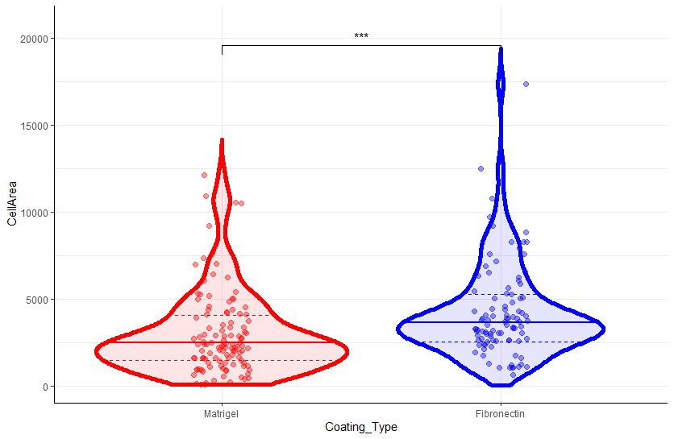

# Violin Plots

<figure><figcaption><p>example violin plot</p></figcaption></figure>

## Current state

### working

* works for the data from the dataFinal after using the filtering blocks to show the cell area between the matrigel and fibronectin coated wt cells
* all is saved in C:\Users\vld-cloud-01\Documents\MANUSCRIPT-YAP1\ANALYSES\ET-1\_SINGLE-CELLS\Integration-of-files-and-plotting\scripts&#x20;
* the scripts which work on dataFinal table are:
  * &#x20;violin\_WT-area-FNvsMG-TPCS\_graph.R&#x20;
  * violin\_WT-area-FNvsMG-TPCS\_graph-settings.R

### next to do

* make the insertion of the items on the x axis automatic using \{{var\}}
* add the titles and stuff
* include all the filtering options there to be just commented out when needed
* export also the statistical comparisons in a table

## Resources


library to add statistics automatically



good overview of the ggplot package with recipes


## Structure

1. There is a file which is used to filter the relevant values from the dataFinal table.&#x20;
2. There is a graph-settings.R file which contains the code blocks for specification of the graph.
3. There is also a violin-plots-template.R file which contains the blocks together.
4. There is functions.R file which is used to store functions

## filtering-blocks-template.R

The following code reads the finalData.csv (after selection, it is located in data04 folder), renames columns to be ggpubr compatible and after filtering outputs table (use the list\_Conditions.csv to see what you want to keep and what to filter out). columns to have a look, summary table to check the filtering and the "filtered\_dataTable.csv" which is used for the violin scripts

### import libraries and source functions.R

```
// Some code
library(tidyverse)
library(ggplot2)
library(ggpubr)
library(RColorBrewer)

source("functions.R")
```

### select file and preprocess the table

```
// Some code

filePath<-normalizePath(file.choose())

dataTable <-read_csv_and_read_csv2(filePath)

dataTable<-dataTable %>%                                # change dashes in column names to underscores for compatibility reasons with ggpubr 
  rename_with(~ gsub("-", "_", .x, fixed = TRUE))

column_names_table<-create_table_of_column_names(dataTable)

view(column_names_table)

write_csv(column_names_table,"column_names_table.csv")
```

### filtering block

```
// Some code
filtered_dataTable<-dataTable %>% 
  filter(  ( ( Exp == 24 ) & ( `Exp_Sub` == 3 ) ) |
             ( ( Exp == 24 ) & ( `Exp_Sub` == 4 ) ) ) %>% 
  #            ( ( Exp == 2 ) & ( `Exp-Sub` == 1 ) ) |
  #            ( ( Exp == 2 ) & ( `Exp-Sub` == 6 ) ) |
  #            ( ( Exp == 3 ) & ( `Exp-Sub` == 1 ) ) ) %>%
  filter( Cell_Line == "H9WT") %>% 
  filter( `Material_Type` == "TCPS" ) %>%
  filter( `Treatment_Conc` == 0 ) %>% 
  filter( (`Actuation_Size`!= 2) | is.na(`Actuation_Size`)) %>% 
  group_by_at(c("Exp",
                "Exp_Sub",
                "Groups",
                "Protein",
                "name",
                "Cell_Line",
                "Cell_Type",
                "Cell_Diff",
                "Cell_Diff_Day",
                "GMO_Type",
                "GMO_Name",
                "GMO_No",
                "Material_Type",
                "Material_Stiffness",
                "Coating_Type",
                "Coating_Conc",
                "Coating_Unit",
                "Treatment_Compound",
                "Treatment_Compund_Short",
                "Treatment_Conc",
                "Treatment_Unit",
                "Actuation_Size",
                "Actuation_Unit",
                "Name_Short",
                "Name_Full",
                "source"
                )
              )
```

### see the effects get output

```
view(filtered_dataTable)

summary_of_filtered_dataTable<- filtered_dataTable %>% 
  dplyr::summarise( N = n ())

view(summary_of_filtered_dataTable)

write_csv(filtered_dataTable,"filtered_dataTable.csv")
```

## functions.R


```
// Some code
require(tidyverse)

# read both comma and semicolon separated columns csv
read_csv_and_read_csv2<- function (filePath) {
  dataTable<-read_csv(filePath,col_names = TRUE)
  if ((ncol(dataTable))==1)
  {
    dataTable<-NULL
    dataTable<-read_csv2(filePath,col_names = TRUE)
  }
  dataTable
}

# create table with column names-numbered
create_table_of_column_names<- function(dataTable){
  column_names<-colnames(dataTable)
  number_of_columns<-length(column_names)
  column_names_table<-tibble(column_number=seq(1:number_of_columns),
                             column_name=column_names
  )
} 

```

## violin-plots-template.R

The following chunks of code are supposed to be integrated in one script, but are separated into different chunks to make the logic more obvious

### Import libraries


```r
library(ggplot2)       # library for plotting
library(tidyverse)     # library for tabular data manipulation
library(ggpubr)        # library for further graph formatting
library(gcookbook)     # library containing example dataset
```


### Dataset and ggplot object


```r
# load the filtered_dataTable.csv file
data_file<-file.choose()

filtered_dataTable<-read_csv(data_file)

dataset<-filtered_dataTable %>% 
  drop_na(CellArea)

dataset$Coating_Type<-as_factor(dataset$Coating_Type) %>% 
  relevel(Coating_Type, ref= "Matrigel")

hw_p <- ggplot(dataset, aes(x = Coating_Type, y = CellArea))
```


### Get info to set the y axis minima and maxima

```r
yMax <- 1.2 * max(dataset$heightIn)  # set maximum for the plot y axis
yMin <- 0.85 * min(dataset$heightIn)  # set minimmum for the plot y axis
```

### Load the graph settings file


```r
getwd()
graph_setings<-file.choose()

source(graph_setings)
```


### Construct the graph using the settings

```r
hw_p +
  ylim(yMin,yMax)+
  colour_settings +
  fill_settings +
  quantiles_settings +
  median_settings +
  violin_settings +
  points_settings +
  theme_settings +
  statistics_settings
```

## Settings File: graph-settings.R

The following chunks of code are supposed to be integrated in one script, but are separated into different chunks to make the logic more obvious

### Import libraries

```r
library(ggplot2)       # library for plotting
library(tidyverse)     # library for tabular data manipulation
library(ggpubr)        # library for further graph formatting
library(gcookbook)     # library containing example dataset
```

### Parameters

Currently only for the scale parameter, will be updated for the parameters which are used in multiple code blocks

```r
scale_param<-"count"   # This parameter is used in three different code chunks
```

### violin\_settings

general settings for the violin plot

```r
violin_settings<-
  geom_violin(aes(colour=Coating_Type, fill = Coating_Type), # decide which parameters should be determined based on the categories of data
            trim=FALSE,        # show the whole violin plot without trimming of the upper and lower part
            linewidth=2,# set the width of the line of the violin plot
            # fill = "transparent",    # set colour of the inside of the violin plot
            # draw_quantiles = c(0.25, 0.5, 0.75), # shaw quantiles
            scale = scale_param,     # adjust the size of the violin plot area or width = 1 is also available
            adjust = 1               # adjust the resolution of the violin the bigger the number, the more approximate it is
            )
```

### quantile\_settings

To plot dashed lines for the 25% and 75% quantiles

```r
quantiles_settings<-
  geom_violin(aes(colour=Coating_Type),
              fill="transparent",
              draw_quantiles = c(0.25, 0.75),
              linetype = "dashed",
              scale = scale_param,
              trim=FALSE
            )
```

In principle it is drawing the whole violin plot AND the quantiles in dashed line. The dashed violin outlines will be overlayed and masked by the general violin from the previous step.

### median\_settings

To plot full line for the median

```r
median_settings<-
  geom_violin(aes(colour=Coating_Type),
              fill="transparent",
              draw_quantiles = 0.5,
              scale = scale_param,
              linewidth = 1,
              trim= FALSE
              )
```

In principle it is drawing the whole violin plot AND the median in solid line. The solid violin outline will be overlayed and masked by the general violin from the previous step.

### points\_settings

To plot semi-transparent points for each observation with colour defined by the group and tunable horizontal spread of the points

```r
points_settings<-
  geom_jitter(aes(colour=Coating_Type), # decide the colour is coded by the category of the data
              alpha = .4, # set transparency
              # colour = "black",
              height = 0,     # vertical jitter
              width = 0.1,    # horizontal spread of the points
              size = 2, # size of points
              )
```

### theme\_settings

To use black and white setting with no bounding block around the plot face

```r
theme_settings<-
  theme_bw() +
  theme(panel.border = element_blank(), # make no frame around the plot
        axis.line = element_line(colour = "black") # make the axis lines black
        )r
```

### colour\_settings

to set the colour (applies to the outlines of the objects) to red and blue

```r
colour_settings<-             # There is a large set of named colors in R, which you can see by running color()
                              # link to rgb colour codes http://html-color-codes.com/
  scale_colour_manual(values = c(Fibronectin = "blue", Matrigel = "red"),
                      guide = FALSE)
```

### fill\_settings

to set the colours for the areas of the violin plots has the alpha lowered to make it more transparent

```r
fill_settings<-
  scale_fill_manual(values = alpha(c(Fibronectin = "blue", Matrigel = "red"), 0.1),
                    guide = FALSE)
```

### my\_comparisons

to set comparison groups for statistics

```
my_comparisons<-list(levels(as.factor(dataset$Coating_Type)))
```

### statistics\_settings

```
statistics_settings<-
  stat_compare_means(comparisons = my_comparisons,   # what groups are compared between themselves
                     label="p.signif",               # what kind of label is used for significance
                     label.y= 0.9 * yMax,            # position of label on y axis
                     method = "t.test")              # statistical method used
```
