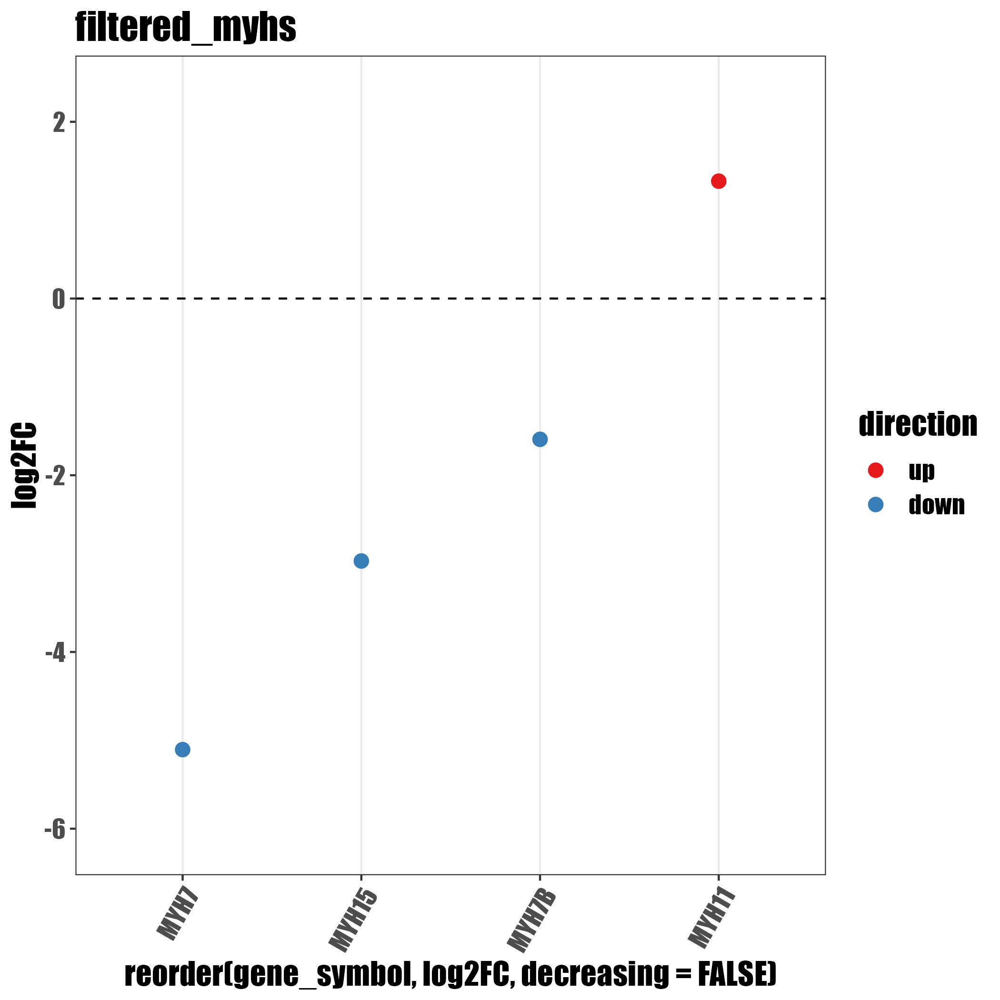

# Plot the top 30 genes from jupiter notebook


<figure><figcaption><p>example output</p></figcaption></figure>

## Example files


subset of DGE file containing only myosine heavy chains&#x20;



subsete of DGE file containing only myosine light chains



code of the script (less commented then below)


## Actual code


```
library(ggplot2)
library(tidyverse)
library(rstudioapi)

# set the working directory to the folder with the script
activeDcoumentContext <- rstudioapi::getActiveDocumentContext()
wd<-dirname(activeDcoumentContext$path)
setwd(wd)
getwd()

# select the folder with the DGE files and list them
dir_to_be_processed<-choose.dir()
files<-list.files(dir_to_be_processed)

# loop over the filenames
for(file in seq_along(files)){

# get the filename, strip extension and prefix, read the file in to get a table
  file_name<-basename(files[file])
  file_name_short_01<-word(file_name, 1,sep = fixed("."))
  file_name_short<-str_remove(file_name_short_01,pattern = "filtered_")  
  complete_table <- read_csv(paste0(dir_to_be_processed,"/",file_name))

# filter the table to get the signifcant genes based on pAdj value and log2fc, select the 30 most differetially expressed, label the up-down regulated
  
  complete_table_up_down <- complete_table %>% 
    dplyr::filter(adj.P.Val<0.05) %>% 
    mutate(log2FC = log2(exp(logFC))) %>% 
    dplyr::filter(abs(log2FC)>0.585) %>% 
    mutate(abs_value=(log2FC*log2FC)) %>%
    slice_max(abs_value,n=30) %>% 
    mutate(direction=ifelse(log2FC>0,"up","down"))

# graph with gene expression sorted from highest to lowest

  complete_table_up_down %>% 
    ggplot(aes(x = reorder(gene_symbol, log2FC, decreasing = FALSE), y = log2FC)) +
    #geom_point(size = 3)+
    geom_point(size = 3, aes(colour = direction)) +
    scale_colour_brewer(palette = "Set1", limits = c("up", "down")) +
    #geom_col(aes(fill = DESCRIPTION), show.legend = FALSE) +
    geom_vline(xintercept = 0, lty=2) +
    geom_hline(yintercept = 0, lty=2) +
   # facet_grid(~DESCRIPTION, scales='free', space = "free_x") +
    ylim(min(complete_table_up_down$log2FC)-1,max(complete_table_up_down$log2FC)+1) +
    theme_bw() +
    theme(
      panel.grid.major.y = element_blank(),
      panel.grid.minor.y = element_blank(),
      #panel.grid.major.x = element_line(colour = "grey60", linetype = "dashed"),
      axis.text.x = element_text(angle = 60, hjust = 1)
    )+
      ggtitle(file_name_short) +
      theme(text = element_text(size = 16, family = "Impact"))
ggsave(paste0(file_name_short,".jpg"))
}

```

